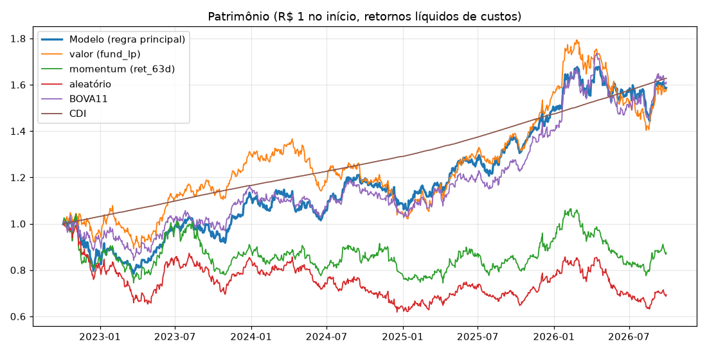
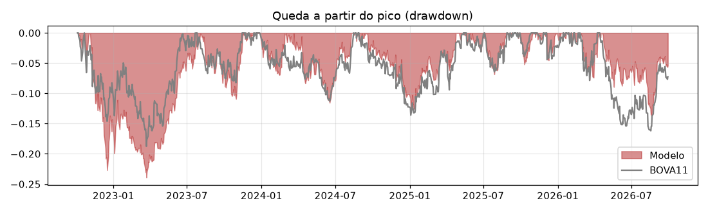

# Backtest (30/09/2026)

- Período: 04/10/2022 a 29/09/2026 (ranking fora da amostra do walk-forward).
- **Regra fixada pelo usuário antes dos resultados:** top 30 do ranking, pesos iguais, rebalanceamento a cada 10 pregões, universo todo (≥ R$ 100 mil/dia), só comprada.
- Execução no fechamento do pregão seguinte ao ranking; retornos com dividendos/JCP/desdobramentos; custos = emolumentos 0,03% + meio spread (0,05% ≥ R$ 5 mi/dia, 0,15% R$ 1–5 mi, 0,50% abaixo) sobre o giro.
- Não considera imposto de renda.

## Resultado

| Estratégia | Retorno total | ao ano | Volatilidade | Sharpe (sobre CDI) | Queda máxima | Giro anual |
|---|---|---|---|---|---|---|
| **Regra principal (top 30, quinzenal, universo todo)** | +58.6% | +12.4% | 17.1% | 0.05 | -23.9% | 9.4x |
| valor (fund_lp), mesma regra | +58.0% | +12.3% | 17.2% | 0.04 | -25.3% | 3.4x |
| momentum (ret_63d), mesma regra | -12.5% | -3.3% | 20.6% | -0.66 | -28.6% | 9.8x |
| aleatório, mesma regra | -30.6% | -8.8% | 20.4% | -0.96 | -38.3% | 22.5x |
| Ibovespa (BOVA11, comprar e segurar) | +61.1% | +12.8% | 17.1% | 0.07 | -18.8% | nanx |
| CDI | +62.8% | +13.1% | 0.1% | 0.00 | 0.0% | nanx |

## Por ano

| | 2022 | 2023 | 2024 | 2025 | 2026 |
|---|---|---|---|---|---|
| Modelo | -11.7% | +28.5% | -4.1% | +38.4% | +5.4% |
| BOVA11 | -5.7% | +23.1% | -10.1% | +34.7% | +14.6% |
| CDI | +3.1% | +13.0% | +10.8% | +14.2% | +10.5% |

## Sensibilidade (mudanças pequenas na regra; resultado bom que some aqui é sinal de sorte)

| Estratégia | Retorno total | ao ano | Volatilidade | Sharpe (sobre CDI) | Queda máxima | Giro anual |
|---|---|---|---|---|---|---|
| N = 20 | +70.8% | +14.5% | 17.5% | 0.16 | -22.4% | 10.3x |
| N = 40 | +46.5% | +10.2% | 17.1% | -0.07 | -22.4% | 8.5x |
| rebalanceamento semanal (5 pregões) | +46.5% | +10.1% | 17.1% | -0.07 | -23.0% | 14.3x |
| rebalanceamento mensal (21 pregões) | +66.1% | +13.7% | 16.6% | 0.11 | -23.0% | 6.1x |
| custos em dobro | +36.5% | +8.2% | 17.2% | -0.17 | -25.1% | 9.4x |
| só ações ≥ R$ 1 mi/dia | +40.3% | +9.0% | 19.3% | -0.10 | -24.2% | 8.9x |
| com folga (vende só se sair do top 60) | +62.2% | +13.0% | 17.4% | 0.08 | -23.5% | 4.7x |
| modelo com eventos | +50.6% | +10.9% | 17.7% | -0.02 | -27.1% | 9.9x |

Material de estudo, não recomendação de investimento.
